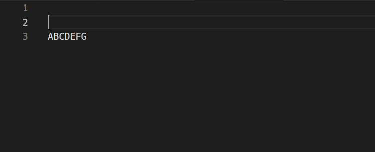

# latex-comment README

Ability to partially comment out LaTeX.

## Usage

- latex-comment.commentOut  
Comment out function. Select a string and `Ctrl+Alt+L` to comment out the selection.
- latex-comment.uncomment  
Uncomment function. Place the cursor on the commented line and `Ctrl+Alt+K` to uncomment the line.

## Example

